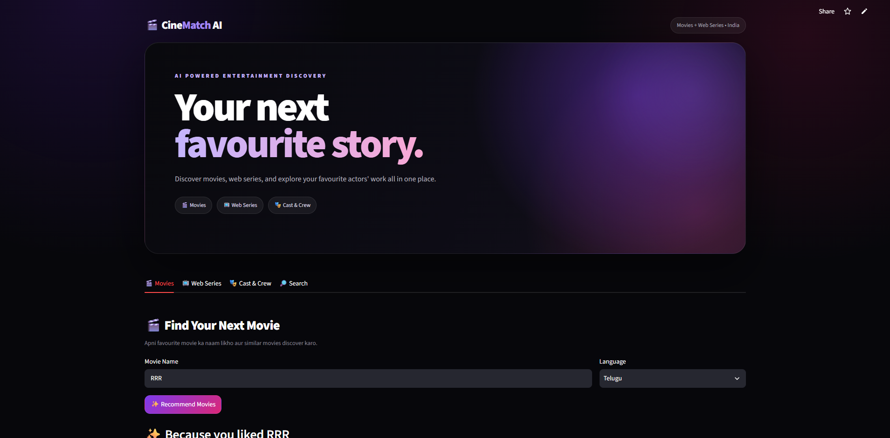
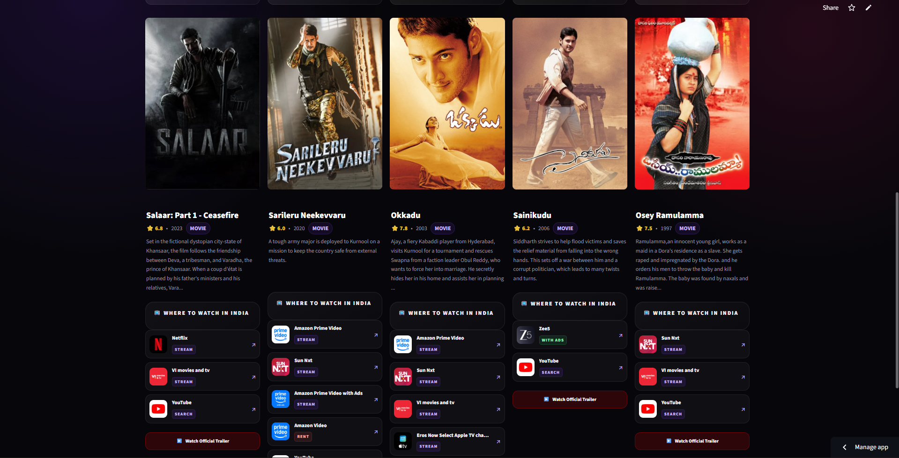
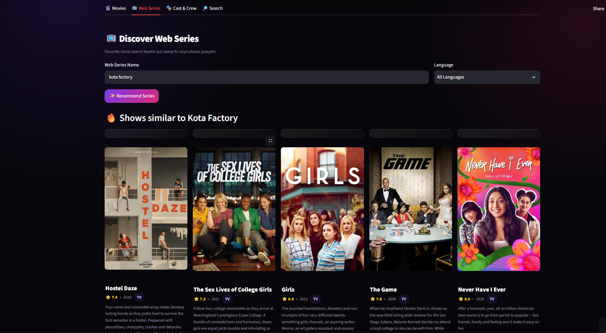
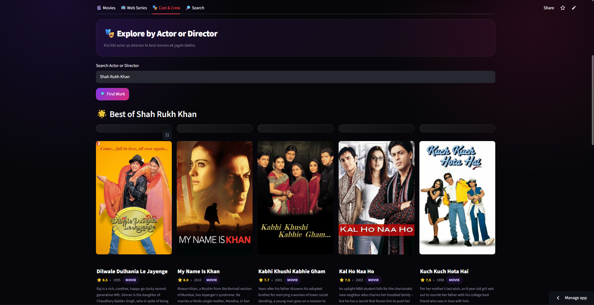
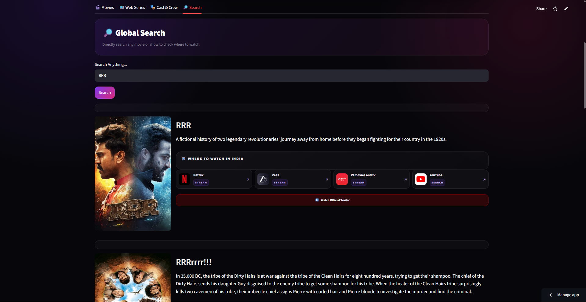

# 🎬 WatchHub India

**WatchHub India** is a movie and web-series discovery platform built with Python and Streamlit. It helps users discover movies and web series, explore cast & crew, search content, view recommendations, and find where a title is available to watch.

🌐 **Live Demo:** https://watchapp-india.streamlit.app/

## ✨ Features

- 🎬 Movie Search
- 📺 Web Series Search
- 🔎 Multi-Content Search
- 🎭 Cast & Crew Information
- 🤖 Smart Movie & Series Recommendations
- 🌐 Language-wise Content Discovery
- 📺 Where to Watch / OTT Providers
- ▶️ YouTube Trailer Links
- 📱 Mobile-Friendly Web Interface
- 🎞️ TMDB API Integration

## 🛠️ Technologies Used

- Python
- Streamlit
- Pandas
- Requests
- Scikit-learn
- TMDB API
- GitHub
- Git LFS

## 🤖 Recommendation System

WatchHub India uses TMDB recommendation and similarity data to find related movies and web series based on the selected title.

## 📺 Where to Watch

The application displays available streaming providers and provides links for users to find the selected movie or series on supported platforms.

## 📸 Screenshots

### 🏠 Home

### 🎬 Movies

### 📺 Web Series

### 🎭 Cast & Crew

### 📺 OTT / Where to Watch

## 🚀 Run Locally

Clone the repository:

bash
git clone https://github.com/deepaknagar-dn/WatchHub-India.git
cd WatchHub-India

Install dependencies:
pip install -r requirements.txt

Run the application:
streamlit run app.py

🔐 API Configuration

Create:  .streamlit/secrets.toml

Add your TMDB API key:
TMDB_API_KEY = "YOUR_TMDB_API_KEY"

📂 Project Structure
WatchHub-India/
│
├── app.py
├── requirements.txt
├── tmdb_5000_movies.csv
├── tmdb_5000_credits.csv
├── .gitignore
└── .gitattributes

👨‍💻 Author

Deepak Nagar

B.Tech — Artificial Intelligence & Machine Learning / Data Science

